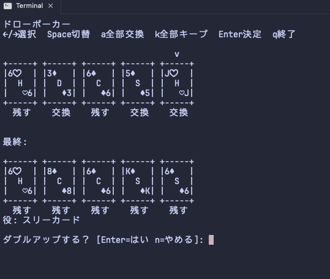
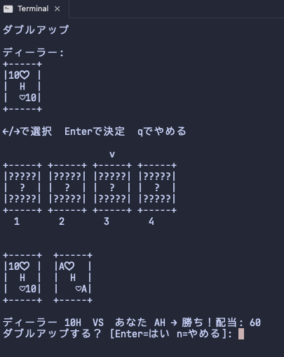

# draw-poker

ターミナルで遊べるビデオポーカー（ドローポーカー）のNode.jsアプリです。


## クイックスタート

```sh
pnpm install
pnpm start
```

## 遊び方

- ベットは1〜10コイン
- 初期コインは100（ファイルに保存され次回起動時に継承）
- 最低役は**ワンペア**（J以上限定なし、あらゆるペアで払い出し）
- ペイテーブルは起動時に表示されます：



| 役 | 1×コイン | 5×コイン | 10×コイン |
|---|---|---|---|
| ロイヤルストレートフラッシュ | 500 | 2500 | **8000** |
| ストレートフラッシュ | 100 | 500 | 1000 |
| フォーカード | 50 | 250 | 500 |
| フルハウス | 10 | 50 | 100 |
| フラッシュ | 7 | 35 | 70 |
| ストレート | 5 | 25 | 50 |
| スリーカード | 3 | 15 | 30 |
| ツーペア | 2 | 10 | 20 |
| ワンペア | 1 | 5 | 10 |
| ハイカード | 0 | 0 | 0 |

- **ダブルアップ**: 勝利後、配当を2倍に賭けられます（最大5連続）。←/→キーでカードを選び、Enterで決定
- **ゲームオーバー**: コインが0になると100コインで続けるか終了するか選択
- ベット額はセッション中は前回の値が引き継がれます（Enterでそのまま確定）


- 負けた時は自動で次のゲームに進みます
- 画面の言語はすべて日本語です

## データ保存

ゲームの進行データは以下の場所に自動で保存されます：

- **`~/.draw-poker/credits.json`** — コイン残高（次回起動時に復元）
- **`~/.draw-poker/highscores.json`** — 歴代記録（最高コイン・最高役・最大ダブルアップ）

環境変数 `DRAW_POKER_DATA_DIR` で保存先ディレクトリを変更できます：

```sh
# カレントディレクトリに保存する例
export DRAW_POKER_DATA_DIR="./draw-poker-data"
pnpm start

# テスト実行時は一時ディレクトリを指定
DRAW_POKER_DATA_DIR=/tmp/test-draw-poker pnpm test
```

## 操作方法

| キー | 操作 |
|---|---|
| `←` / `→` | カード選択（ダブルアップでも使用） |
| `Space` | 選択中のカードを交換する/しないを切替 |
| `a` | すべてのカードを交換 |
| `k` | カード交換をすべて解除 |
| `Enter` | 決定（交換実行 / ダブルアップのカード確定） |
| `q` | 終了 |

## コマンド

- `pnpm start` — ゲームを起動
- `pnpm test` — テスト実行（Node.js標準テストランナー）
- `pnpm build` — 構文チェック
